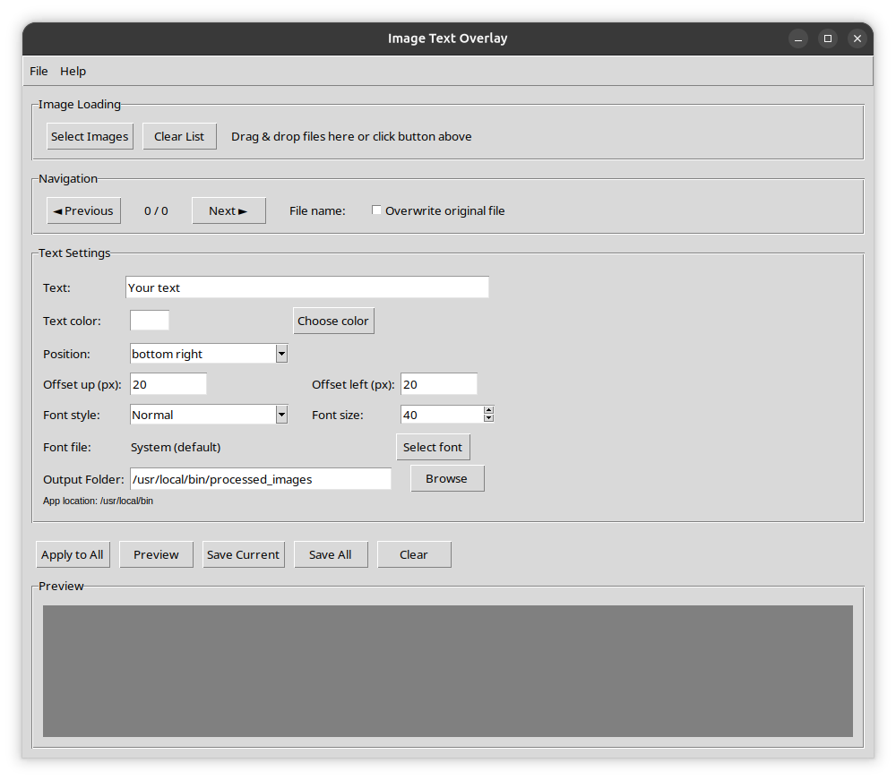

# 🖼️ Image Text Overlay

A powerful desktop application for adding text overlays to images with batch processing support.

## ✨ Features

- 📊 **Batch Processing** - Process multiple images at once with the same text settings
- 🖱️ **Drag & Drop Support** - Simply drag and drop images into the application
- 🎨 **Text Customization** - Customize text content, color, font, size, and style
- 📍 **Position Control** - Choose from multiple text positions with offset adjustments
- 👁️ **Preview Functionality** - See how your text will look before saving
- 💾 **Flexible Saving Options** - Save to a separate folder or overwrite original files
- 🔤 **Font Selection** - Use system fonts or load custom `.ttf` and `.otf` files
- 🧭 **User-Friendly Interface** - Intuitive design with clear navigation

## 🖼️ Preview



## 📥 Installation

### 📋 Prerequisites
- Python 3.6 or higher
- Required Python packages

### 📦 Install from Source

1. Clone or download the repository:
```bash
git clone https://github.com/EvgeniyPavlenko85/image-text-overlay.git
cd image-text-overlay
```

2. Install required dependencies:
```bash
pip install -r requirements.txt
```

### 📚 Dependencies

The application requires the following Python packages:
- `Pillow` 🖼️ - For image processing
- `tkinterdnd2` (optional) 🖱️ - For drag & drop support

### 🛠️ Installing tkinterdnd2 (Optional)

For drag & drop functionality, install:
```bash
pip install tkinterdnd2
```

## 🚀 Usage

### 📝 Basic Workflow

1. **Load Images** 🖼️
   - Click "Select Images" button or
   - Drag & drop image files into the application window

2. **Customize Text Settings** 🎨
   - Enter your desired text
   - Choose text color (click "Choose color")
   - Select font style and size
   - Adjust text position and offsets
   - Optionally load a custom font file

3. **Apply to Images** ▶️
   - Click "Preview" to see the result on the current image
   - Click "Apply to All" to process all loaded images

4. **Save Results** 💾
   - "Save Current" - Save the currently displayed image
   - "Save All" - Save all processed images
   - Check "Overwrite original file" to replace originals

### ⬅️➡️ Navigation Controls
- **Previous/Next** - Navigate through loaded images
- **File name** - Shows the current file being edited
- **Counter** - Shows current image position (e.g., "3 / 10")

### ℹ️ Text Settings Explained

| Setting | Description |
|---------|-------------|
| Text | The text to overlay on images |
| Text color | Color of the text (click to open color picker) |
| Position | Where to place the text on the image |
| Offset up | Distance from top/bottom edge (in pixels) |
| Offset left | Distance from left/right edge (in pixels) |
| Font style | Normal, Bold, Italic, or Bold Italic |
| Font size | Size of the text (10-200) |
| Font file | Select custom .ttf or .otf font file |

### 📁 Supported Image Formats
- PNG (`.png`)
- JPEG (`.jpg`, `.jpeg`)
- BMP (`.bmp`)
- GIF (`.gif`)
- TIFF (`.tiff`, `.tif`)

## 🔨 Building Standalone Executable

### Using PyInstaller

1. Install PyInstaller:
```bash
pip install pyinstaller
```

2. Build the executable:
```bash
pyinstaller --onefile --windowed --hidden-import=PIL._tkinter_finder --hidden-import=PIL._imagingtk --name ImageTextOverlay main.py
```

### Using the Build Script

```bash
make pyinstaller
```

## 📂 File Structure

```
image-text-overlay/
├── main.py              # Main application file
├── Makefile             # Build script for PyInstaller
├── requirements.txt     # Python dependencies
├── README.md            # This documentation
├── LICENSE.md           # License file
├── screenshot.png       # Application screenshot
└── processed_images/    # Default output directory
```

## ▶️ Running the Application

### From Source
```bash
python main.py
```

### Building Standalone Executable
```bash
make pyinstaller
```
Or manually:
```bash
pyinstaller --onefile --windowed --hidden-import=PIL._tkinter_finder --hidden-import=PIL._imagingtk --name ImageTextOverlay main.py
```

The executable will be created in the `dist/` folder.

## 🔧 Troubleshooting

### 🖱️ Drag & Drop Not Working
- Ensure `tkinterdnd2` is installed: `pip install tkinterdnd2`
- The application will still work without drag & drop using the "Select Images" button

### 🔤 Font Loading Issues
- The application will fall back to system fonts if custom font fails to load
- Supported font formats: `.ttf`, `.otf`

### 🖼️ Image Processing Errors
- Make sure images are not corrupted or in unsupported formats
- Check that you have write permissions for the output directory

## ℹ️ About

**Version:** 1.0.0  
**License:** Freeware  
**Author:** Pavlenko Evgeniy  
**Email:** pavlenkoevgeniy85@gmail.com  

Copyright © 2026

## 🤝 Contributing

Feel free to submit issues, feature requests, or pull requests on the GitHub repository.

## 📜 Changelog

### Version 1.0.0
- Initial release
- Batch image processing
- Drag & drop support
- Customizable text overlay
- Preview functionality
- Multiple saving options

## 📧 Support

For issues or questions:
- Email: pavlenkoevgeniy85@gmail.com
- GitHub Issues: [Create an issue](https://github.com/EvgeniyPavlenko85/image-text-overlay/issues)

---

**Note:** This application is designed to run on Windows, macOS, and Linux platforms that support Python and Tkinter.